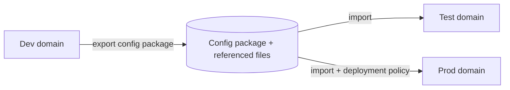
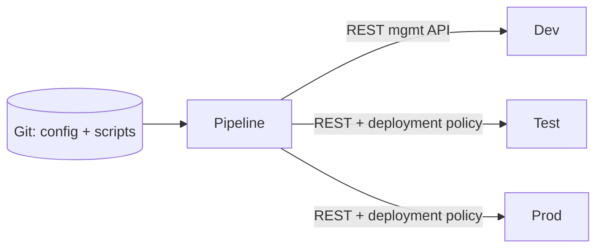

# Config Management

:::info Lesson status
This lesson is a focused **outline**. Expand with the linked IBM docs.
:::

Getting a service working on one gateway is step one. **Promoting** that
configuration cleanly through dev → test → prod, repeatably, is what makes a
DataPower estate maintainable.

## Export / import

Because configuration is object-based and domain-scoped, you can move it as a
unit:

- Export a **whole domain** or **selected objects**, including referenced files
  (stylesheets, scripts, certs as appropriate).
- Import into another domain or device.

## Deployment policies

Environments differ — hostnames, ports, credentials, backend URLs. A
**deployment policy** rewrites these environment-specific values during import,
so the *same* package promotes everywhere without hand-editing:

- **Accept / filter / modify** rules applied to objects on import.
- Change backend host/port, drop dev-only objects, set environment values.

## CI/CD for DataPower

- Keep configuration and source artifacts (stylesheets, GatewayScript, schemas)
  in **version control**.
- Drive deployment through the **REST management interface** with a deployment
  policy per environment.
- Validate after deploy by checking **op-state** and running smoke tests.

## Outline: topics to expand

- Export formats and what to include/exclude.
- Writing deployment-policy rules for host/port/credential substitution.
- Secrets handling (don't bake credentials into packages).
- Blue/green and rolling updates with container edition on Kubernetes.

## Reference

- IBM Docs: *Configuration management*, *Deployment policy*, and the
  *REST management interface* in the
  [DataPower documentation](https://www.ibm.com/docs/en/datapower-gateway).

<Quiz questions={[
  {
    prompt: 'What problem does a deployment policy solve during config import?',
    options: [
      {text: 'It compiles the firmware'},
      {text: 'It rewrites environment-specific values (hostnames, ports, credentials) so one package promotes across environments', correct: true},
      {text: 'It terminates TLS'},
      {text: 'It deletes the default domain'},
    ],
    explanation: 'A deployment policy applies accept/filter/modify rules on import, substituting environment-specific values so the same config package works in dev, test, and prod.',
  },
]} />

<LessonComplete lessonId="administration-ops/config-management" />
