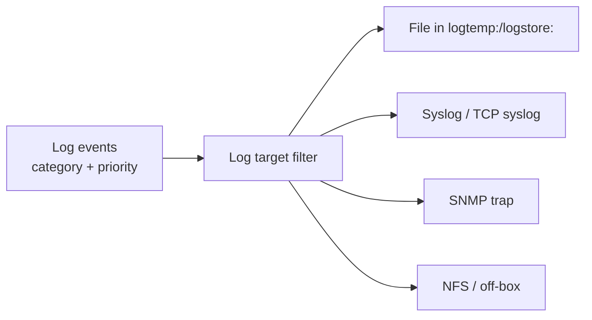

# Logging & Monitoring

:::info Lesson status
This lesson is a focused **outline**. Expand with the linked IBM docs.
:::

DataPower generates rich logs and exposes detailed runtime status. The job is to
**route the right logs to the right place** and watch the metrics that matter.

## Log targets

A **log target** is an object that captures log events matching a filter and
sends them somewhere:

- Filter by **event category** (auth, mpgw, ssl, xmlfirewall, …) and
  **priority** (debug → info → notice → warn → error → critical).
- Send to **files**, **syslog/TCP**, **SNMP**, **NFS**, or off-box collectors.
- In production, ship logs **off-box** (syslog/DPOD) so they survive restarts and
  can be searched centrally.

## Status & monitoring

- **Status providers**: object op-state, CPU, memory, connection counts, TLS,
  queue depths — via WebGUI, CLI `show`, or REST.
- **Monitors**: *message monitors* and *service-level monitoring (SLM)* enforce
  and observe rates/quotas.
- **DPOD** aggregates logs/transactions/metrics across many gateways.

## Outline: topics to expand

- The default log and the **system log**; adjusting log level safely in prod.
- Creating a syslog log target and verifying delivery.
- Correlating a transaction across logs via the **global transaction ID**.
- Key metrics to alert on (memory, op-state down, TLS/cert errors).

## Reference

- IBM Docs: *Logging* and *Log target* in the
  [DataPower documentation](https://www.ibm.com/docs/en/datapower-gateway).

<Quiz questions={[
  {
    prompt: 'What does a log target do?',
    options: [
      {text: 'It compiles XSLT'},
      {text: 'It captures log events matching a filter (category + priority) and sends them to a destination', correct: true},
      {text: 'It terminates TLS'},
      {text: 'It defines the backend URL'},
    ],
    explanation: 'A log target filters events by category and priority and routes them to files, syslog, SNMP, NFS, or off-box collectors.',
  },
]} />

<LessonComplete lessonId="administration-ops/logging-monitoring" />
