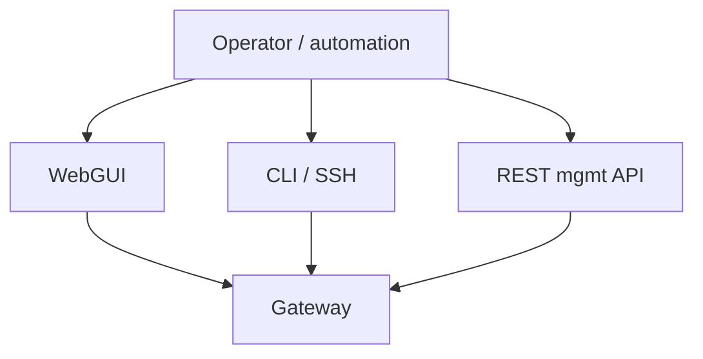

# Administration & Operations: Overview

Building a service is half the story; **running** it is the other half. This
module covers the day-2 concerns: the management surfaces, logging and
monitoring, troubleshooting, and moving configuration between environments.

## Management surfaces (recap + ops view)

- **WebGUI** — best for inspection, ad-hoc changes, and the built-in
  troubleshooting tools (probe, packet capture).
- **CLI** — scripting, precise control, and `write memory` to persist config.
- **REST management API** — automation, health checks, and CI/CD pipelines.

## What day-2 actually involves

| Concern | Covered in |
| --- | --- |
| Seeing what the gateway is doing | [Logging & Monitoring](/docs/administration-ops/logging-monitoring) |
| Finding out why a request failed | [Troubleshooting](/docs/administration-ops/troubleshooting) |
| Promoting config dev → test → prod | [Config Management](/docs/administration-ops/config-management) |
| Persisting changes | `Save Config` / `write memory` (Module 2) |
| Health & capacity | Status providers, monitors, load balancer groups |

## Health and status at a glance

DataPower exposes a large set of **status providers** (object op-state, CPU,
memory, connections, TLS, etc.) via the WebGUI, CLI (`show ...`), and REST. These
feed dashboards and alerting. The **DataPower Operations Dashboard (DPOD)** is a
companion product that aggregates logs, transactions, and metrics across many
gateways for centralised monitoring.

## Operational habits worth forming

- **Save deliberately.** Know what's in running vs. persisted config before a
  restart (Module 2).
- **Watch op-state, not just admin-state.** "Enabled but down" is the most
  common false alarm.
- **Mind certificate expiry.** Expiring certs silently take services down.
- **Automate promotion.** Manual clicking doesn't scale or stay consistent —
  export/import with deployment policies does.

The following lessons are concise outlines you can expand with the linked IBM
docs.

<Quiz questions={[
  {
    prompt: 'Which management surface is the right choice for automated, pipeline-driven operations and health checks?',
    options: [
      {text: 'The serial console'},
      {text: 'The REST management API', correct: true},
      {text: 'Manually clicking the WebGUI'},
      {text: 'None — DataPower can’t be automated'},
    ],
    explanation: 'The REST management API is built for automation, health checks, and CI/CD; the WebGUI and CLI suit interactive work.',
  },
  {
    prompt: 'What does the DataPower Operations Dashboard (DPOD) provide?',
    options: [
      {text: 'A replacement for the firmware'},
      {text: 'Centralised aggregation of logs, transactions, and metrics across many gateways', correct: true},
      {text: 'A new front-side handler protocol'},
      {text: 'A code editor for XSLT'},
    ],
    explanation: 'DPOD is a companion monitoring product that aggregates operational data across a fleet of gateways.',
  },
]} />

<LessonComplete lessonId="administration-ops/overview" />
