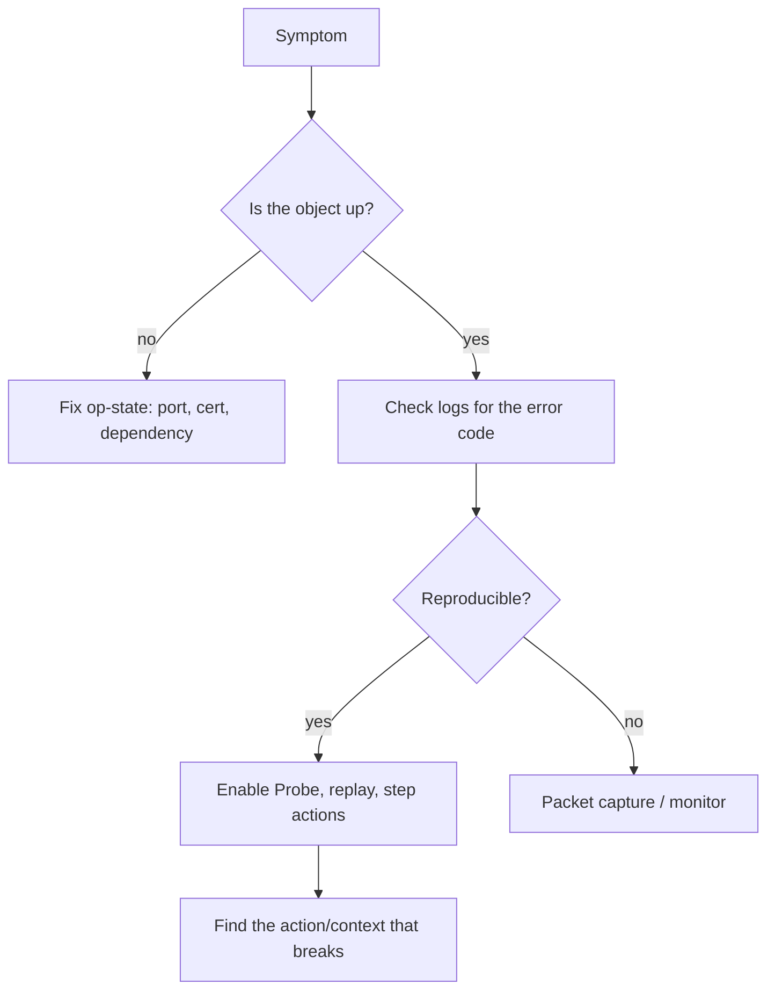

# Troubleshooting

:::info Lesson status
This lesson is a focused **outline**. Expand with the linked IBM docs.
:::

When a service misbehaves, DataPower gives you powerful built-in tools to see
*exactly* what happened to a message as it flowed through the policy.

## The toolbox

| Tool | Use it to… |
| --- | --- |
| **Probe (Multistep Probe)** | Capture a transaction and step through each action, inspecting the message and variables at every context |
| **Packet capture** | Capture network traffic on an interface for protocol/TLS issues |
| **Error report** | Generate a full diagnostic bundle for IBM support |
| **Logs** | The first place to look — category/priority filtered |
| **Status providers** | Check op-state, connections, memory |

:::warning Probe in production
The Probe adds overhead and stores message data. Enable it to reproduce an
issue, then **turn it off** — don't leave it running in production.
:::

## A practical debugging workflow

1. **Check op-state first** (enabled ≠ up).
2. **Read the logs** for the error code and message.
3. **Reproduce with the Probe** and step through actions/contexts to find where
   the message goes wrong.
4. **Packet capture** for transport/TLS-level problems.
5. **Error report** if you need IBM support.

## Common culprits

- Action **wiring** (reading INPUT instead of the previous output).
- **Namespace** mismatches in XSLT matches.
- **Certificate** expiry / trust gaps taking TLS down.
- **Port conflicts** leaving a handler enabled-but-down.

## Reference

- IBM Docs: *Troubleshooting*, *Multistep Probe*, and *Packet capture* in the
  [DataPower documentation](https://www.ibm.com/docs/en/datapower-gateway).

<Quiz questions={[
  {
    prompt: 'Which built-in tool lets you step through each action of a captured transaction and inspect the message at every context?',
    options: [
      {text: 'Packet capture'},
      {text: 'The Multistep Probe', correct: true},
      {text: 'The error report'},
      {text: 'A log target'},
    ],
    explanation: 'The Probe captures a transaction and lets you inspect the message and variables at each action/context — ideal for policy debugging. Remember to disable it afterwards.',
  },
]} />

<LessonComplete lessonId="administration-ops/troubleshooting" />
