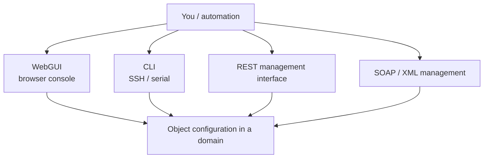
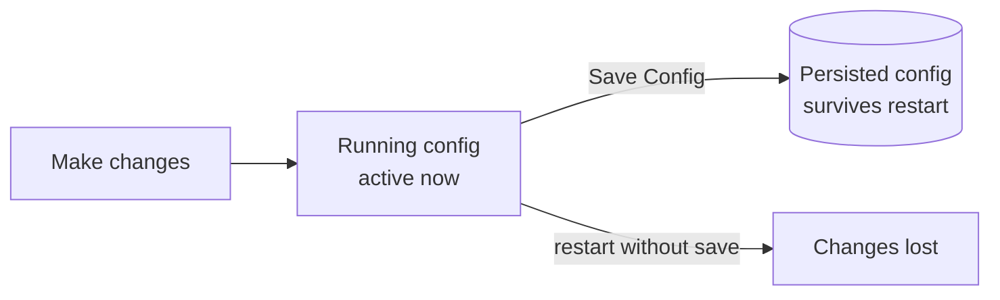

# Configuration Model

You've seen that DataPower is a graph of objects living inside domains. This
lesson covers *how you actually create and manage* that configuration, and the
crucial difference between the **running** configuration and the **persisted**
one.

## Ways to configure a gateway

- **WebGUI** — the browser-based console. Best for learning and ad-hoc work; you
  can *see* the object model.
- **CLI** — a command-line interface over SSH (or serial on the appliance).
  Organised into configuration modes per object type. Great for scripting and
  precise control.
- **REST management interface** — modern, JSON-based API for automation and
  CI/CD. Preferred for declarative, pipeline-driven deployment.
- **SOAP/XML management (SOMA / AMP)** — the older programmatic interface; still
  widely used by tooling.

All of these manipulate the **same** underlying objects.

## Running config vs. persisted config

This is the single most important operational concept in this lesson:

- The **running configuration** is what's live in memory right now. Changes take
  effect immediately as you make them.
- The **persisted (startup) configuration** is what's written to disk and
  reloaded on restart.

**Changes are not automatically saved.** If you configure a service and the
gateway restarts before you save, your changes are gone.

:::warning Save your config
After making changes you want to keep, **Save Configuration** (WebGUI) or
`write memory` (CLI). Make this a habit — especially in the labs.
:::

## Promoting configuration between environments

Because configuration is object-based and domain-scoped, you can move it cleanly:

- **Export** a domain (or selected objects) to a config package.
- **Import** it into another domain or device.
- Use **deployment policies** to rewrite environment-specific values (hostnames,
  ports, credentials) during import — so the same package promotes from dev to
  prod without manual editing.

This export/import + deployment-policy flow is the backbone of DataPower CI/CD,
which we revisit in [Config Management](/docs/administration-ops/config-management).

<Quiz questions={[
  {
    prompt: 'You configured a new service in the WebGUI but did not save. The gateway restarts. What happens?',
    options: [
      {text: 'The configuration is automatically preserved'},
      {text: 'The unsaved changes are lost — running config wasn’t persisted', correct: true},
      {text: 'The gateway refuses to restart'},
      {text: 'The default domain is deleted'},
    ],
    explanation: 'Changes apply to the running config immediately but are not persisted until you Save Config (or `write memory`). A restart drops unsaved changes.',
  },
  {
    prompt: 'Which interface is best suited for declarative, CI/CD-driven automation of DataPower?',
    options: [
      {text: 'The serial console only'},
      {text: 'The REST management interface', correct: true},
      {text: 'There is no automation interface'},
      {text: 'The WebGUI clicked by hand'},
    ],
    explanation: 'The REST management interface (alongside config export/import and deployment policies) is the modern choice for automated, pipeline-driven deployment.',
  },
]} />

<LessonComplete lessonId="architecture/configuration-model" />
