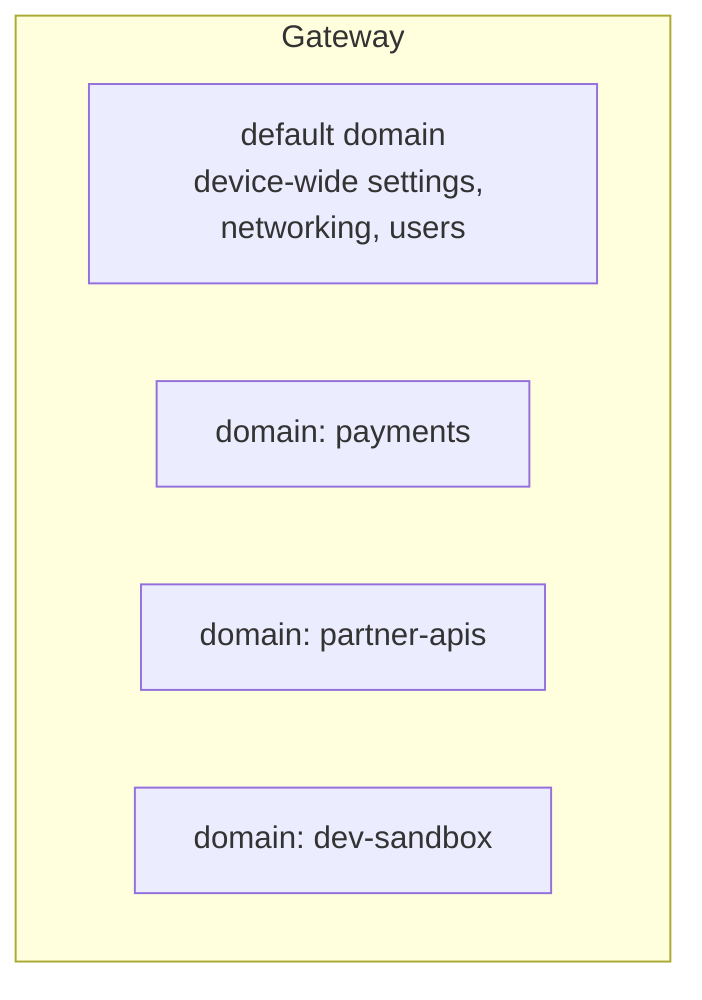

# Domains

A **domain** is DataPower's unit of configuration isolation. Think of it as a
self-contained workspace: each domain has its own services, objects, files, and
logs, separate from every other domain on the same gateway.

## The default domain vs. application domains

- **`default` domain** — always present. It holds **device-wide** configuration:
  network interfaces, DNS, system-level users, firmware, and the management
  interfaces. You generally keep application services *out* of here.
- **Application domains** — you create one per application, team, environment,
  or tenant. Services you build (gateways, proxies) live in these.

## Why isolate with domains?

- **Multi-tenancy.** Different teams or applications share one gateway without
  seeing or breaking each other's configuration.
- **Blast-radius control.** Restarting, importing, or breaking one domain
  doesn't affect the others.
- **Delegated administration.** You can grant a user rights to *their* domain
  only, not the whole device.
- **Clean promotion.** A domain's configuration can be exported and imported as
  a unit when promoting from dev → test → prod.

## What lives in a domain

Each application domain has its own:

- Services (Multi-Protocol Gateways, Web Service Proxies, etc.)
- Configuration objects (handlers, policies, crypto profiles, AAA policies)
- A **file system** with directories such as `local:`, `cert:`, and `temporary:`
- Log targets and log files

:::info Shared vs. isolated
Network connectivity, system users, and firmware are **device-wide** (configured
in `default`). Application configuration is **domain-local**. A crypto *key* you
upload into one domain is not visible to another unless you put it there too.
:::

## Common file stores inside a domain

| Store | Purpose |
| --- | --- |
| `local:` | Your configuration files, stylesheets, scripts |
| `cert:` | Certificates and keys (write-only for keys; not readable back) |
| `store:` | Read-only system-provided files (sample stylesheets, schemas) |
| `temporary:` | Scratch space, cleared on restart |
| `logtemp:` / `logstore:` | Log files |

We'll create our own application domain in the [labs](/docs/labs/intro).

<Quiz questions={[
  {
    prompt: 'What kind of configuration belongs in the default domain?',
    options: [
      {text: 'Each application’s business services'},
      {text: 'Device-wide settings: network interfaces, DNS, system users, firmware', correct: true},
      {text: 'Nothing — the default domain is unused'},
      {text: 'Only customer data'},
    ],
    explanation: 'The default domain holds device-wide settings. Application services live in separate application domains.',
  },
  {
    prompt: 'Why create separate application domains?',
    options: [
      {text: 'To make the gateway run faster'},
      {text: 'Isolation: multi-tenancy, blast-radius control, delegated admin, clean promotion', correct: true},
      {text: 'Domains are required to enable HTTP'},
      {text: 'To share all keys automatically between teams'},
    ],
    explanation: 'Domains isolate configuration so teams/apps/environments don’t interfere with one another and can be administered and promoted independently.',
  },
]} />

<LessonComplete lessonId="architecture/domains" />
