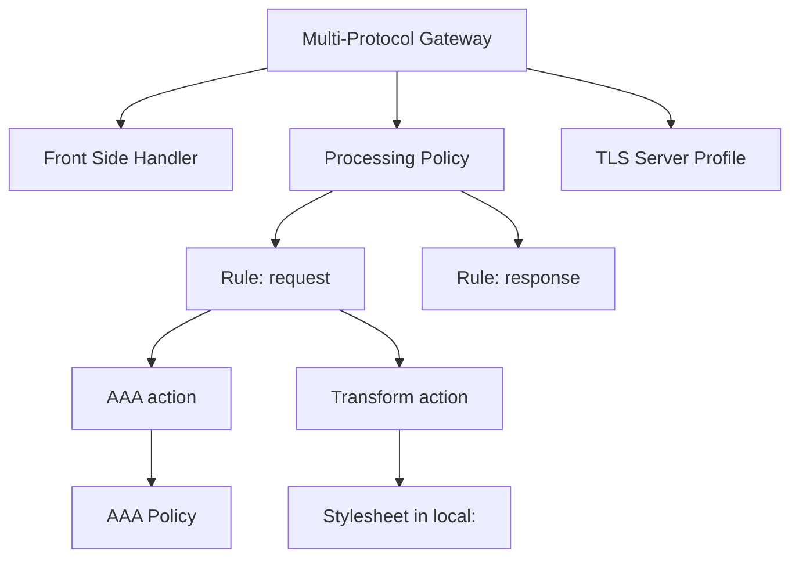
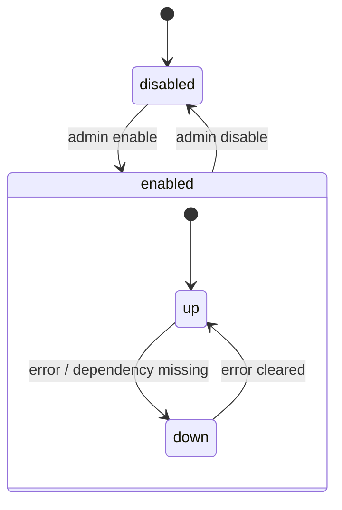

# The Object Model

Almost everything you configure in DataPower is an **object**. A service is an
object; so is a TLS profile, a front-side handler, an AAA policy, a log target,
and a crypto key reference. Understanding this object model is the key that
unlocks the whole product — once you see the pattern, every screen in the WebGUI
makes sense.

## Objects reference other objects

Objects are composed by **reference**. A Multi-Protocol Gateway doesn't *contain*
its handler and policy inline — it *points at* them. This lets you reuse the same
TLS profile or AAA policy across many services.

Because references are shared, deleting an object that others depend on is
blocked (or warned) — DataPower tracks the dependency graph for you.

## Every object has two states

This trips up newcomers constantly, so internalise it now:

- **Administrative state** — what *you* asked for: `enabled` or `disabled`.
- **Operational state** — what's *actually true*: `up` or `down`.

An object can be **enabled** (admin) but **down** (operational) — for example,
a handler enabled on a port that's already in use will be admin-enabled but
operationally down. When something "isn't working", your first question is
always: *is it up, or just enabled?*

## Naming and reuse

- Objects have a **type** (e.g. `MultiProtocolGateway`, `SSLServerProfile`) and a
  **name** unique within that type and domain.
- Give objects clear, consistent names — they become references everywhere.
- Prefer **reusable** shared objects (one TLS profile referenced by ten services)
  over copy-paste.

## Where you see it

- In the **WebGUI**, the *Objects* menu lists every object type; each service
  page is really an editor for one object plus links to the objects it
  references.
- In the **CLI**, you enter configuration mode for an object type and set its
  properties.
- In **config exports**, each object is serialised as a block — which is why
  exports are portable between domains and devices.

<Quiz questions={[
  {
    prompt: 'A handler is "enabled" but the service still isn’t accepting traffic. What should you check first?',
    options: [
      {text: 'Whether the operational state is "up" (enabled ≠ up)', correct: true},
      {text: 'Whether the gateway supports HTTP at all'},
      {text: 'Whether you are using the physical appliance'},
      {text: 'Nothing — enabled always means working'},
    ],
    explanation: 'Administrative state (enabled/disabled) is what you asked for; operational state (up/down) is reality. An enabled object can still be down.',
  },
  {
    prompt: 'How are DataPower objects typically composed?',
    options: [
      {text: 'Everything is inlined into one giant service object'},
      {text: 'Objects reference other objects, enabling reuse (e.g. one TLS profile shared by many services)', correct: true},
      {text: 'Objects cannot reference each other'},
      {text: 'Only the default domain has objects'},
    ],
    explanation: 'DataPower composes configuration by reference, which is what makes objects like TLS profiles and AAA policies reusable across services.',
  },
]} />

<LessonComplete lessonId="architecture/object-model" />
