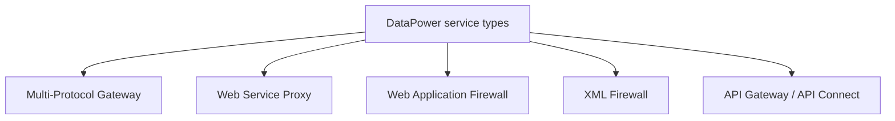
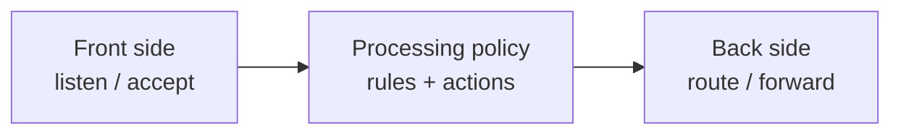

# Services Overview

A **service** is the top-level object that actually listens for traffic and
processes it. DataPower offers several service types, each tuned for a purpose.
You'll spend most of your time with the Multi-Protocol Gateway, but it helps to
know the menu.

## The main service types

### Multi-Protocol Gateway (MPGW)

The **general-purpose workhorse**. Accepts requests on one or more protocols via
*front-side handlers*, runs a *processing policy*, and forwards to a backend.
Use it when you need flexible mediation, protocol bridging, or custom policy.
Module 3 is dedicated to it.

### Web Service Proxy (WSP)

Specialised for **SOAP web services**. You point it at one or more WSDLs and it
auto-generates endpoints, validates messages against the schema, and lets you
attach policy at the service/port/operation level. Use it to govern existing
SOAP services.

### XML Firewall

An older, simpler service for **securing a single XML/SOAP endpoint** —
request/response processing with threat protection. Largely superseded by the
MPGW and WSP for new work, but you'll still encounter it.

### Web Application Firewall

Tailored to protect **HTTP web applications** (form/cookie handling, header
rewriting, HTML-oriented threat protection).

### API Gateway (API Connect)

The modern **API-management** service. When DataPower runs as the gateway for
IBM API Connect, APIs defined in the control plane are deployed here and
executed with an API-specific policy/assembly model.

## How to choose

| If you need to… | Use |
| --- | --- |
| Bridge protocols, custom mediation, anything general | **Multi-Protocol Gateway** |
| Govern existing SOAP services from WSDL | **Web Service Proxy** |
| Manage REST APIs with plans, quotas, portal | **API Gateway (API Connect)** |
| Protect a classic HTML web app | **Web Application Firewall** |
| Secure one simple XML endpoint (legacy) | **XML Firewall** |

## The common shape

Despite their differences, every service follows the same shape, which is why
learning the MPGW transfers everywhere:

We unpack each stage starting in Module 3.

<Quiz questions={[
  {
    prompt: 'Which service is the general-purpose workhorse you’ll use for protocol bridging and custom mediation?',
    options: [
      {text: 'XML Firewall'},
      {text: 'Multi-Protocol Gateway', correct: true},
      {text: 'Web Application Firewall'},
      {text: 'Web Service Proxy'},
    ],
    explanation: 'The MPGW is the flexible, general-purpose service. Other types are specialisations.',
  },
  {
    prompt: 'You want to govern a set of existing SOAP services defined by WSDL, with schema validation and per-operation policy. Which service fits best?',
    options: [
      {text: 'Web Service Proxy', correct: true},
      {text: 'Web Application Firewall'},
      {text: 'API Gateway only'},
      {text: 'None — DataPower can’t read WSDL'},
    ],
    explanation: 'The Web Service Proxy is purpose-built around WSDLs: it generates endpoints, validates against schema, and supports service/port/operation-level policy.',
  },
]} />

<LessonComplete lessonId="architecture/services-overview" />
