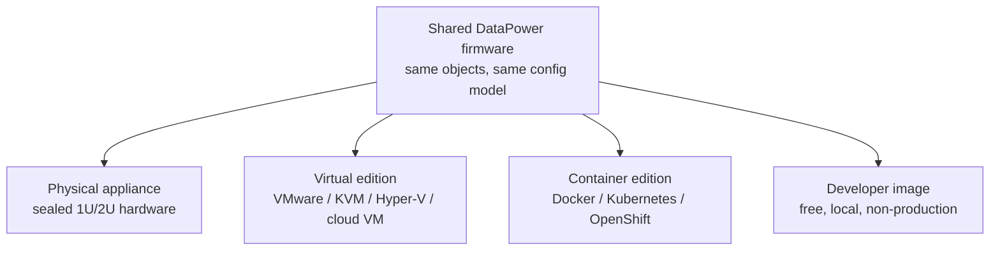

# Form Factors

DataPower Gateway ships in several **form factors**. They all run the same core
firmware and configuration model, so skills transfer directly between them. What
differs is *where* and *how* the gateway runs.

## The four editions

### Physical appliance

A sealed, hardened **hardware appliance** (e.g. the IDG / X2 line). No
general-purpose OS shell, tamper-resistant, and historically includes
**hardware acceleration** for cryptographic and XML processing. Chosen when you
need maximum throughput, the strongest security posture, or hardware-anchored
key storage (an HSM).

### Virtual edition

The same firmware packaged as a **virtual appliance** for VMware, KVM,
Hyper-V, or a cloud VM. Easier to provision and scale than buying hardware,
while keeping the appliance security model. No hardware crypto acceleration —
crypto runs in software.

### Container edition

DataPower as a **container image** for Docker, Kubernetes, and OpenShift. This
is the modern default for cloud-native deployments: gateways scale horizontally
as pods, configuration is delivered declaratively, and they fit CI/CD pipelines.

### Developer edition (DataPower Gateway for Developers)

A **free, non-production** container image for learning and development. It's
fully functional for building and testing configurations — just not licensed
for production traffic. **This is what we'll use for the labs.**

## How to choose

| Need | Likely choice |
| --- | --- |
| Maximum throughput, HSM, strongest hardening | Physical appliance |
| Existing virtualization estate, no new hardware | Virtual edition |
| Cloud-native, Kubernetes/OpenShift, autoscaling | Container edition |
| Learning, dev, CI test | Developer edition |

:::note Skills are portable
Because every edition shares the firmware and configuration model, a service
you build on the developer container behaves the same way on a physical
appliance. You design once and deploy anywhere.
:::

<Quiz questions={[
  {
    prompt: 'Which form factor would you use to learn and build configurations locally for free?',
    options: [
      {text: 'Physical appliance'},
      {text: 'DataPower Gateway for Developers (container image)', correct: true},
      {text: 'Virtual edition with a production license'},
      {text: 'None — you must buy hardware to start'},
    ],
    explanation: 'The developer edition is a free, fully functional, non-production container image — ideal for learning and the labs in this course.',
  },
  {
    prompt: 'What is the main thing the physical appliance offers that the virtual/container editions do not?',
    options: [
      {text: 'A completely different configuration model'},
      {text: 'Hardware acceleration and hardware-anchored key storage (HSM)', correct: true},
      {text: 'The ability to run DataPower services at all'},
      {text: 'Support for HTTP'},
    ],
    explanation: 'All editions share the firmware and config model. The appliance adds hardware crypto/XML acceleration and HSM-backed key storage.',
  },
]} />

<LessonComplete lessonId="fundamentals/form-factors" />
