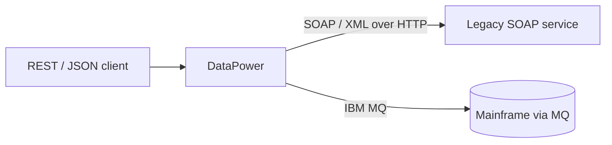

# Common Use Cases

DataPower is flexible, but most real deployments fall into a handful of
recurring patterns. Recognising them helps you reach for the right service type
later in the course.

## 1. API gateway

Expose REST/JSON APIs to mobile, web, and partner consumers while protecting the
microservices behind them.

- Enforce API keys / OAuth / JWT validation.
- Rate-limit and quota per consumer.
- Convert between client-facing and backend representations.
- Emit analytics for every call.

This is the role DataPower plays as the engine inside **IBM API Connect**.

## 2. Security gateway

Act as the hardened DMZ tier that terminates TLS and enforces authentication
and authorisation before anything reaches the internal network.

- TLS termination and re-encryption (mutual TLS to backends).
- **AAA**: authenticate the caller, authorise the action, audit the event.
- Message-level security: verify signatures, decrypt WS-Security payloads.
- **Threat protection**: reject XML bombs, oversized messages, SQL/JSON injection
  patterns, and malformed requests.

## 3. Integration / protocol bridging

Bridge mismatched systems by translating both **protocol** and **message
format** in a single hop.

- REST/JSON ⇆ SOAP/XML.
- HTTP ⇆ IBM MQ / TIBCO EMS / FTP.
- XML ⇆ JSON ⇆ flat/binary files.

This is the classic ESB-style mediation that DataPower has always been strong
at.

## 4. Web service proxy & governance

Front existing SOAP web services with a managed proxy that validates against
WSDL, enforces WS-Security, applies SLAs, and centralises logging — without
touching the original service.

## Choosing the right pattern

| You want to… | Reach for |
| --- | --- |
| Publish and protect REST APIs | API gateway pattern (often via API Connect) |
| Terminate TLS + enforce AAA at the edge | Security gateway pattern |
| Connect REST to MQ / SOAP / flat files | Multi-Protocol Gateway (integration) |
| Govern existing SOAP services | Web Service Proxy |

We'll implement several of these hands-on in [Module 7 · Labs](/docs/labs/intro),
starting from the **Multi-Protocol Gateway** — the most general service type,
covered next in Module 3.

<Quiz questions={[
  {
    prompt: 'A mobile app speaks REST/JSON but the backend is a SOAP/XML service over IBM MQ. Which DataPower use case is this?',
    options: [
      {text: 'Static website hosting'},
      {text: 'Integration / protocol bridging', correct: true},
      {text: 'Database replication'},
      {text: 'Source-code compilation'},
    ],
    explanation: 'Translating both protocol (HTTP↔MQ) and message format (JSON↔XML) in one hop is the integration / protocol-bridging pattern.',
  },
  {
    prompt: 'Which of these is a "security gateway" responsibility?',
    options: [
      {text: 'Rendering HTML for the browser'},
      {text: 'Terminating TLS and enforcing AAA and threat protection at the edge', correct: true},
      {text: 'Storing application business data'},
      {text: 'Running the mobile app'},
    ],
    explanation: 'The security-gateway pattern centralises TLS, authentication/authorisation/audit, and threat protection in the DMZ tier.',
  },
]} />

<LessonComplete lessonId="fundamentals/use-cases" />
