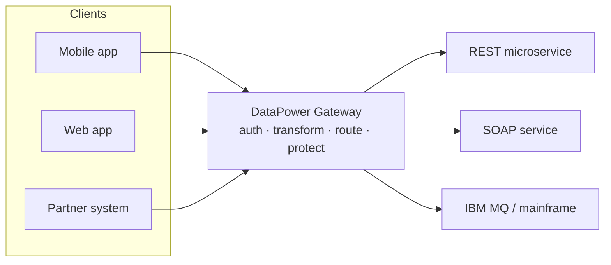

# What is DataPower Gateway?

**IBM DataPower Gateway** is a purpose-built **security and integration gateway**.
It sits at the boundary of your network and mediates traffic between clients and
backend services — authenticating callers, enforcing policy, transforming
message formats, and routing requests, all before a request ever reaches your
application.

If you've heard the term "API gateway", DataPower is that and more. It predates
the modern API-gateway category and grew out of the world of XML, SOAP, and
enterprise service buses (ESBs), so it is unusually strong at **message-level
processing** and **security** — not just simple proxying.

## The one-sentence definition

> DataPower Gateway is a hardened, multi-protocol gateway that secures,
> transforms, and routes traffic at the edge of the enterprise.

## Why it exists

Backend systems are valuable and fragile. Exposing them directly to the internet
(or even to other internal teams) creates problems:

- **Security** — every backend would need to implement authentication,
  authorisation, TLS, and threat protection itself.
- **Protocol mismatch** — a mobile app speaks REST/JSON; a mainframe service
  speaks SOAP/XML or IBM MQ. Something has to translate.
- **Policy sprawl** — rate limits, logging, and routing rules end up duplicated
  in every service.

A gateway centralises these concerns into one hardened tier:

## What makes DataPower distinctive

- **Hardened by design.** The appliance form factor ships as a sealed, hardened
  device with no general-purpose OS shell — reducing attack surface. Virtual and
  container editions inherit the same hardened firmware.
- **Multi-protocol.** HTTP/HTTPS, WebSphere MQ, IBM MQ, TIBCO EMS, FTP/SFTP,
  NFS, IMS, and more — often bridging between them in a single service.
- **Message-aware.** It can parse, validate, and transform XML, JSON, SOAP, and
  binary/flat-file formats at high throughput, including hardware-accelerated
  XML processing on the physical appliance.
- **Security-first.** Built-in TLS termination, an AAA (authentication,
  authorisation, audit) framework, message-level encryption/signing (WS-Security),
  and threat protection (XML/JSON attack defence).

## Where you'll meet it

DataPower commonly serves as:

- An **API gateway** in front of REST/JSON microservices (and is the gateway
  engine inside **IBM API Connect**).
- A **security gateway** terminating TLS and enforcing AAA at the DMZ.
- An **integration / ESB-style gateway** bridging protocols and transforming
  message formats between mismatched systems.

We'll dig into each of these in [Common Use Cases](/docs/fundamentals/use-cases).

<Quiz questions={[
  {
    prompt: 'In one phrase, what is DataPower Gateway?',
    options: [
      {text: 'A relational database for message logs'},
      {text: 'A hardened gateway that secures, transforms, and routes traffic at the edge', correct: true},
      {text: 'A front-end JavaScript framework'},
      {text: 'A container orchestration platform'},
    ],
    explanation: 'DataPower is a security and integration gateway that mediates traffic between clients and backends.',
  },
  {
    prompt: 'Which capability is DataPower especially known for, compared to a basic reverse proxy?',
    options: [
      {text: 'Message-level processing and security (transform, validate, AAA, WS-Security)', correct: true},
      {text: 'Hosting static websites'},
      {text: 'Compiling application source code'},
      {text: 'Acting as a primary data store'},
    ],
    explanation: 'DataPower grew out of the XML/SOAP/ESB world and excels at message-aware processing and security, not just proxying.',
  },
]} />

<LessonComplete lessonId="fundamentals/what-is-datapower" />
