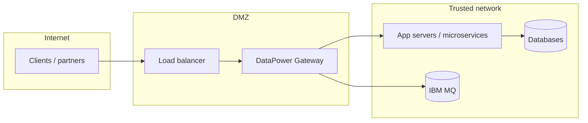
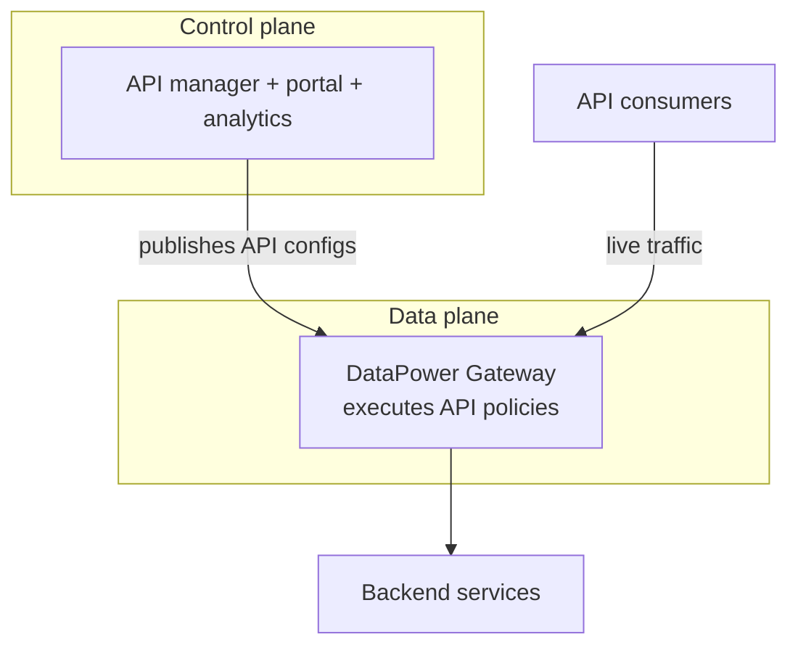

# Where It Fits

A gateway is only useful if it sits in the right place in your network. This
lesson positions DataPower in a typical enterprise topology and relative to the
other pieces of an API platform.

## In the network: the DMZ

DataPower is most often deployed in the **DMZ** — the controlled network zone
between the public internet and the trusted internal network. It becomes the
single, hardened entry point through which external traffic must pass.

Key consequences of this placement:

- **TLS terminates at the gateway.** Clients establish TLS to DataPower; the
  gateway can then re-encrypt to backends (mutual TLS) or talk plain HTTP inside
  the trusted zone.
- **Backends are never directly exposed.** Only DataPower's front-side
  addresses are reachable from outside.
- **Policy is enforced before the backend.** Authentication, threat checks, and
  rate limits happen at the edge, so a malformed or malicious request is
  rejected early.

## In the API platform: the data plane

In an API-management context (notably **IBM API Connect**), responsibilities
split into a **control plane** and a **data plane**:

- **Control plane** — where you *design and manage* APIs: the developer portal,
  API definitions, product/plan packaging, analytics, and lifecycle.
- **Data plane** — where API *traffic actually flows* and policies execute at
  runtime. **DataPower is the data plane / gateway engine.**

You configure an API once in the control plane; the gateway enforces it for
every call.

## Gateway vs. the things around it

- **Load balancer** distributes connections but doesn't understand messages.
  DataPower sits *behind* it and does the message-aware work.
- **Web/app server** runs your application logic. DataPower sits *in front* of
  it and offloads cross-cutting concerns.
- **Service mesh** secures east-west traffic *inside* a cluster. DataPower
  typically guards **north-south** traffic at the edge — they complement each
  other.

<Quiz questions={[
  {
    prompt: 'In a classic enterprise topology, where is DataPower usually deployed?',
    options: [
      {text: 'Inside the database tier'},
      {text: 'In the DMZ, as the hardened entry point between internet and trusted network', correct: true},
      {text: 'On each client device'},
      {text: 'Only in the control plane'},
    ],
    explanation: 'DataPower lives in the DMZ so all external traffic passes through a single hardened gateway before reaching backends.',
  },
  {
    prompt: 'In IBM API Connect terms, DataPower is the…',
    options: [
      {text: 'Control plane (design and management)'},
      {text: 'Data plane / gateway engine (runtime traffic and policy enforcement)', correct: true},
      {text: 'Developer portal'},
      {text: 'Analytics database'},
    ],
    explanation: 'API Connect manages APIs in the control plane; DataPower is the data plane that executes policies on live traffic.',
  },
]} />

<LessonComplete lessonId="fundamentals/where-it-fits" />
