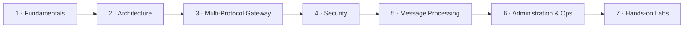

# Welcome to the DataPower Gateway course

This is a **self-paced, hands-on course** on IBM DataPower Gateway, built by
Skunkworks Academy. It takes you from "what is this thing and why does it exist"
all the way to configuring real services, securing them, and operating them in
production.

You don't need prior DataPower experience. You *should* be comfortable with
general networking (HTTP, TLS), the idea of an API or web service, and reading
the occasional XML or JSON document.

## How the course is structured

The material is organised into seven modules. Each builds on the last, so the
recommended path is top to bottom — but every lesson stands on its own if you
want to jump around.

| Module | What you'll learn |
| --- | --- |
| **1 · Fundamentals** | What DataPower is, its form factors, and where it fits |
| **2 · Architecture** | Domains, the object model, services, and configuration |
| **3 · Multi-Protocol Gateway** | The core service: handlers, policies, rules |
| **4 · Security** | TLS/crypto, AAA, threat protection |
| **5 · Message Processing** | Transforms, GatewayScript, error handling |
| **6 · Administration & Ops** | CLI/WebGUI, logging, troubleshooting, config |
| **7 · Hands-on Labs** | Put it together with guided exercises |

## How to use it

- **Read, then check yourself.** Most lessons end with a short *Knowledge
  Check* quiz. Answer before revealing the explanation — it's the cheapest way
  to find out what didn't stick.
- **Mark lessons complete.** Each lesson has a *Mark lesson complete* button.
  Your progress is saved in your browser (via `localStorage`) and shown on the
  [home page](/). Nothing is sent to a server.
- **Do the labs.** Module 7 is where the concepts become muscle memory. Even if
  you only read along, the labs tie everything together.

:::tip Get hands-on access
The labs assume access to a DataPower Gateway. The easiest way to get one for
learning is the **IBM DataPower Gateway for Developers** container image, which
runs locally under Docker/Podman. We cover setup in the
[labs introduction](/docs/labs/intro).
:::

Ready? Start with [What is DataPower Gateway?](/docs/fundamentals/what-is-datapower)

<LessonComplete lessonId="intro" />
