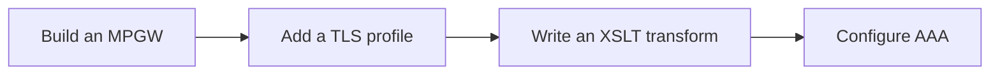

# Hands-on Labs

Reading takes you so far; the labs make it stick. This module walks you through
building real services on a **free, local** DataPower Gateway.

## Get a gateway: the Developer edition

The easiest learning environment is the **IBM DataPower Gateway for Developers**
container image. It's the full firmware, free for non-production use, and runs
locally under Docker or Podman.

:::warning Non-production only
The developer image is licensed for development and testing, **not** production
traffic. Perfect for this course.
:::

### Pull and run

The exact image coordinates change over time — check IBM's current published
image — but the shape is:

```bash
# Pull the developer image (replace tag with the current one)
docker pull icr.io/integration/datapower/datapower-limited:latest

# Run it, exposing the WebGUI (9090), CLI (2200), and a service port (8443)
docker run -it \
  -e DATAPOWER_ACCEPT_LICENSE=true \
  -e DATAPOWER_INTERACTIVE=true \
  -p 9090:9090 \
  -p 2200:22 \
  -p 8443:8443 \
  --name datapower \
  icr.io/integration/datapower/datapower-limited:latest
```

On first boot, accept the license and (when prompted at the interactive console)
enable the **web management** interface so you can reach the WebGUI.

### Log in to the WebGUI

1. Browse to `https://localhost:9090` (accept the self-signed cert warning).
2. Log in with the default admin credentials you set at first boot.
3. You'll land in the **default domain**.

:::tip Verify your install
If the WebGUI loads and you can see the *Control Panel*, you're ready. If not,
check the container logs (`docker logs datapower`) and that web-mgmt was enabled.
:::

## Create your lab domain

Don't build in `default`. Create an application domain for the labs:

1. In the WebGUI, switch to **Administration → Configuration → Application
   Domain**.
2. Create a domain named `lab` and apply.
3. Switch into the `lab` domain (top-right domain selector). All labs assume
   you're working **inside `lab`**.

## Lab roadmap



| Lab | You'll build |
| --- | --- |
| [Build an MPGW](/docs/labs/lab-build-mpgw) | An HTTP gateway with a front-side handler and a static backend |
| [Add a TLS Profile](/docs/labs/lab-tls-profile) | Terminate HTTPS on the gateway with a TLS server profile |
| [Write an XSLT Transform](/docs/labs/lab-xslt-transform) | Reshape a message with a stylesheet *(outline)* |
| [Configure AAA](/docs/labs/lab-aaa) | Authenticate and authorise requests *(outline)* |

:::note Save your work
After each lab, **Save Configuration** (Module 2) so a container restart doesn't
wipe your progress.
:::

<LessonComplete lessonId="labs/intro" />
