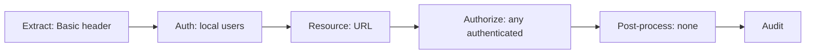

# Lab: Configure AAA

:::info Lab status
This lab is an **outline** with the key steps. Expand it as you experiment; it
builds on [The AAA Framework](/docs/security/aaa).
:::

**Goal:** protect `echo-gateway` with an **AAA policy** so only authenticated,
authorised callers get through. We'll start with the simplest case — HTTP Basic
auth against a local user list — then point you toward token-based auth.

**Prerequisites:** the `echo-gateway` MPGW; you're in the **`lab`** domain.

## Step 1 — Create an AAA policy

**Objects → XML Processing → AAA Policy → Add**, name it `lab-aaa`. Configure the
six phases (recall the pipeline from Module 4):

1. **Extract Identity:** **HTTP Authentication Header** (Basic auth).
2. **Authenticate:** **Local** — define a small set of users, or authenticate
   against an LDAP/OIDC source if you have one.
3. **Extract Resource:** **URL sent by client**.
4. **Authorize:** **Allow any authenticated client** (tighten later with
   group/URL rules).
5. **Post-Processing:** none for now (later: mint a backend token).
6. **Audit:** leave auditing on.



## Step 2 — Add the AAA action to the policy

1. Edit `echo-policy`'s request rule.
2. Drop an **AAA action** near the **start** of the rule (authenticate before
   doing expensive work).
3. Select the `lab-aaa` policy.
4. Wire input from the match output; on success processing continues, on failure
   an error is raised (see [Error Handling](/docs/message-processing/error-handling)).
5. Apply and **Save Configuration**.

## Step 3 — Test

```bash
# Without credentials → expect 401 Unauthorized
curl -ik https://localhost:8443/get

# With valid Basic credentials → expect success
curl -ik -u labuser:labpass https://localhost:8443/get
```

## Outline: expand this lab

- Swap Basic auth for **JWT / OAuth 2.0** token validation in the Authenticate
  phase.
- Authorise by **LDAP group** membership or by URL pattern.
- Use **Post-Processing** to generate an **LTPA** or fresh **JWT** for the
  backend.
- Add **audit** log review (see [Logging & Monitoring](/docs/administration-ops/logging-monitoring)).

<Quiz questions={[
  {
    prompt: 'Where in the request rule should the AAA action generally go?',
    options: [
      {text: 'At the very end, after the backend call'},
      {text: 'Near the start, so unauthenticated callers are rejected before expensive processing', correct: true},
      {text: 'It does not matter where it goes'},
      {text: 'Only in the response rule'},
    ],
    explanation: 'Authenticate early: placing AAA near the start of the request rule rejects bad callers before validation, transformation, or backend calls run.',
  },
]} />

<LessonComplete lessonId="labs/lab-aaa" />
