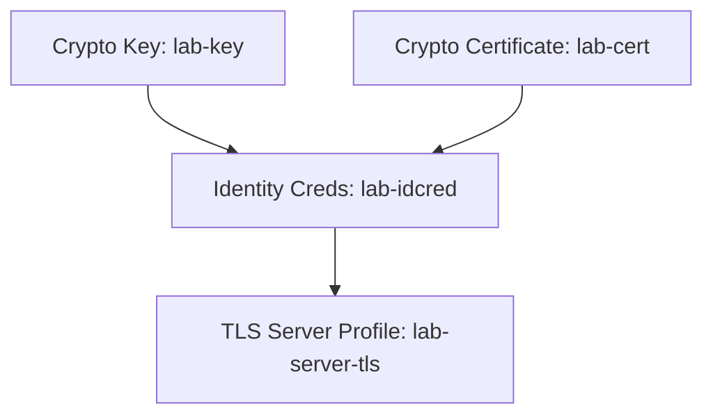
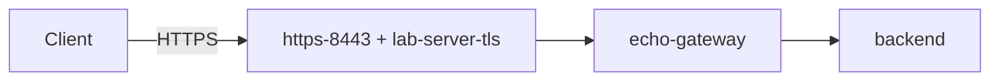

# Lab: Add a TLS Profile

**Goal:** secure the gateway from [the previous lab](/docs/labs/lab-build-mpgw)
with TLS, so clients connect over **HTTPS** on port `8443`. You'll assemble the
crypto object hierarchy from [TLS & Crypto Objects](/docs/security/tls-crypto)
and reference it from an HTTPS front-side handler.

**Prerequisites:** the `echo-gateway` MPGW from the previous lab; you're in the
**`lab`** domain.

**Estimated time:** 25–35 minutes.

## Step 1 — Get a key and certificate

For a lab, a self-signed certificate is fine. Generate one on your host:

```bash
openssl req -x509 -newkey rsa:2048 -nodes \
  -keyout lab-key.pem -out lab-cert.pem \
  -days 365 -subj "/CN=datapower-lab.local"
```

Upload both files into the gateway's **`cert:`** store:

1. **Administration → Main → File Management** (or the file upload in the crypto
   wizards).
2. Upload `lab-key.pem` and `lab-cert.pem` into `cert:`.

:::note Keys are write-only
Recall that `cert:` keys can be written but not read back — that's by design.
:::

## Step 2 — Create the crypto objects

Build the hierarchy bottom-up (Objects → Crypto Configuration):

1. **Crypto Key** — name `lab-key`, file `cert:///lab-key.pem`.
2. **Crypto Certificate** — name `lab-cert`, file `cert:///lab-cert.pem`.
3. **Crypto Identity Credentials** — name `lab-idcred`, referencing `lab-key`
   and `lab-cert`.



(For one-way server TLS you don't need validation credentials. Add them later if
you want to require client certs / mutual TLS.)

## Step 3 — Create the TLS Server Profile

1. **Objects → Crypto Configuration → TLS Server Profile** → **Add**.
2. **Name:** `lab-server-tls`.
3. **Identity Credentials:** `lab-idcred`.
4. **Protocols:** enable **TLS 1.2** (and 1.3 if available); disable older
   protocols.
5. Apply.

## Step 4 — Add an HTTPS Front Side Handler

1. On `echo-gateway`, add a new **HTTPS (SSL) Front Side Handler** named
   `https-8443`.
2. **Port:** `8443`, **Local IP:** `0.0.0.0`.
3. **TLS type:** Server profile → select `lab-server-tls`.
4. Apply, and add the handler to the gateway (you can keep the HTTP handler too,
   or remove it to force HTTPS only).



## Step 5 — Apply, save, and test

1. **Apply** the gateway; confirm `https-8443` op-state is **up**.
2. **Save Configuration.**
3. Test from your host (publish the port with `-p 8443:8443` on the container):

```bash
# -k accepts the self-signed cert for this lab
curl -ik https://localhost:8443/get
```

A successful TLS handshake plus a proxied backend response means TLS termination
works.

## Troubleshooting

- **Handshake failure** → check the server profile references valid identity
  credentials and an enabled protocol the client supports.
- **Handler down** → port conflict, or the referenced TLS profile is itself down
  (a bad key/cert reference). Fix the dependency; op-state propagates up.
- **Cert errors in curl without `-k`** → expected for self-signed; use `-k` in
  the lab or trust the cert.

## Stretch goals

- Enable **mutual TLS**: create **validation credentials** from a CA cert and
  require client certificates on the server profile.
- Add a **TLS client profile** on the back side to re-encrypt to an HTTPS
  backend.

<Quiz questions={[
  {
    prompt: 'Which crypto object does a TLS Server Profile reference to present the gateway’s own certificate to clients?',
    options: [
      {text: 'Validation Credentials'},
      {text: 'Identity Credentials (key + certificate)', correct: true},
      {text: 'A Front Side Handler'},
      {text: 'A Load Balancer Group'},
    ],
    explanation: 'Identity credentials pair the private key and certificate the gateway presents. Validation credentials are the trust store for the *other* party’s cert.',
  },
]} />

<LessonComplete lessonId="labs/lab-tls-profile" />
