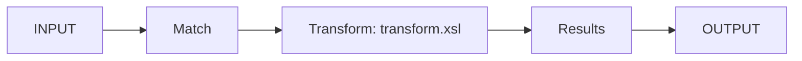

# Lab: Write an XSLT Transform

:::info Lab status
This lab is an **outline** with the key steps and a working stylesheet. Expand it
as you experiment; it builds directly on
[Transform Actions (XSLT)](/docs/message-processing/transforms).
:::

**Goal:** add a **Transform action** to your gateway policy that reshapes the
request body before it reaches the backend.

**Prerequisites:** the `echo-gateway` MPGW; you're in the **`lab`** domain.

## Step 1 — Write the stylesheet

Save this as `transform.xsl` and upload it to **`local:`**:

```xml
<xsl:stylesheet version="1.0"
    xmlns:xsl="http://www.w3.org/1999/XSL/Transform"
    xmlns:dp="http://www.datapower.com/extensions"
    extension-element-prefixes="dp">
  <xsl:output method="xml" indent="yes"/>

  <xsl:template match="/request">
    <order>
      <id><xsl:value-of select="orderId"/></id>
      <customer><xsl:value-of select="customer/name"/></customer>
      <total><xsl:value-of select="amount"/></total>
    </order>
    <xsl:message dp:priority="info">transform.xsl ran</xsl:message>
  </xsl:template>
</xsl:stylesheet>
```

## Step 2 — Set the message types

On `echo-gateway`, set **Request Type** to `XML` (or `JSON` and add a
**Convert** action first) so the body parses into a node tree the transform can
process.

## Step 3 — Add the Transform action

1. Edit `echo-policy`'s request rule.
2. Between the **Match** and the final **Results** action, drop a **Transform
   action**.
3. **Stylesheet:** `local:///transform.xsl`.
4. Wire it: input = the match's output context, output = a new context that feeds
   the Results action (don't leave it reading `INPUT` by mistake).
5. Apply.



## Step 4 — Test and verify

```bash
curl -ik https://localhost:8443/orders \
  -H 'Content-Type: application/xml' \
  -d '<request><orderId>42</orderId><customer><name>Ada</name></customer><amount>99.50</amount></request>'
```

Use the **Probe** ([Troubleshooting](/docs/administration-ops/troubleshooting))
to confirm the message is reshaped at the Transform action's output context.

## Outline: expand this lab

- Convert **JSON→XML** first, then transform, then **XML→JSON** out.
- Use `dp:set-variable` to also set the dynamic backend from the stylesheet.
- Add a **Validate** action against an XSD before transforming.

<LessonComplete lessonId="labs/lab-xslt-transform" />
