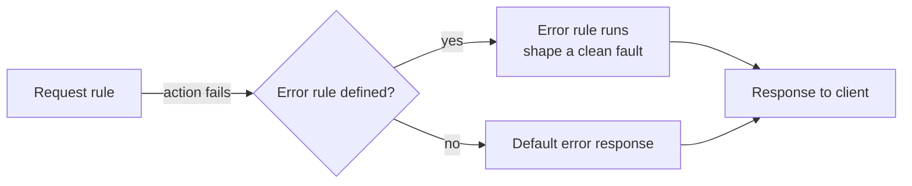

# Error Handling

:::info Lesson status
This lesson is a focused **outline**. The model is complete; expand with the
linked IBM docs.
:::

When an action fails — a validation error, a backend timeout, a rejected
message — processing doesn't just stop silently. DataPower raises an **error**
and, if you've configured one, runs an **error rule**.

## How errors flow

## Building blocks

- **Error rule** — a rule with direction *Error*. It typically matches on an
  **error code** and runs actions to build a sensible client-facing response.
- **Error code / message variables** — when something fails, variables such as
  the error code, sub-code, and message are populated so your error rule can
  inspect what went wrong (`var://service/error-code`,
  `var://service/error-subcode`, error message variables).
- **`dp:reject` / `session.reject`** — explicitly fail a transaction from XSLT or
  GatewayScript, which then drives the error rule.
- **On-Error action** — within a rule you can place an action that directs flow
  to specific handling when a subsequent action errors.

## Designing good faults

- **Don't leak internals.** Map raw backend errors and stack traces to clean,
  generic client messages; log the detail internally instead.
- **Use the right status.** Return appropriate HTTP status codes (4xx for client
  errors, 5xx for gateway/backend) and a consistent error body (JSON or SOAP
  Fault).
- **Be consistent.** A single error-shaping stylesheet/script reused across
  services keeps fault formats uniform.
- **Log for diagnosis.** Emit a correlatable log entry (transaction id) so ops
  can trace the failure — see [Logging & Monitoring](/docs/administration-ops/logging-monitoring).

## Outline: topics to expand

- Matching specific **error codes** in error rules.
- Distinguishing client vs. backend failures and timeouts.
- Producing **SOAP Fault** vs. **JSON error** bodies by service type.
- Correlating errors with transaction IDs in logs.

## Reference

- IBM Docs: *Error handling* and *Processing rule (error)* in the
  [DataPower documentation](https://www.ibm.com/docs/en/datapower-gateway).

<Quiz questions={[
  {
    prompt: 'What triggers an error rule to run?',
    options: [
      {text: 'Every successful request'},
      {text: 'An action failing or an explicit reject (dp:reject / session.reject)', correct: true},
      {text: 'Saving the configuration'},
      {text: 'A new front-side handler'},
    ],
    explanation: 'Errors are raised by failing actions or explicit rejects; if an error rule is defined, it runs to shape the fault response.',
  },
  {
    prompt: 'A good practice when returning errors to clients is to…',
    options: [
      {text: 'Return the raw backend stack trace'},
      {text: 'Map internal failures to clean, generic messages and log the detail internally', correct: true},
      {text: 'Always return HTTP 200'},
      {text: 'Disable logging'},
    ],
    explanation: 'Avoid leaking internals: return consistent, generic client errors with appropriate status codes while logging the detail for ops.',
  },
]} />

<LessonComplete lessonId="message-processing/error-handling" />
