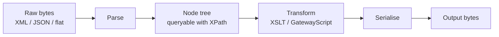

# Message Processing: Overview

DataPower's super-power is doing real work *on the message*, at speed. This
module covers the transform actions and error handling that turn a processing
policy from a router into a mediation engine.

## How DataPower sees a message

Internally, DataPower works on a parsed representation of the message rather
than raw bytes. XML and SOAP parse naturally into a node tree; **JSON** is
parsed into a compatible tree (often via a JSONx representation) so the same
XML-oriented tooling — XPath, XSLT — can operate on it.

This is why an MPGW's **request/response type** matters (XML, JSON, SOAP,
Non-XML, Pass-Thru): it tells the engine how to parse the body.

## The processing toolkit

| Tool | Best for |
| --- | --- |
| **XSLT (Transform action)** | Declarative XML→XML/JSON transformation, structural reshaping | 
| **GatewayScript** | Imperative logic, JSON-first work, calling services, complex branching |
| **Validate action** | Enforcing a schema/WSDL |
| **Convert action** | Turning non-XML (form posts) into nodes |

The two big tools are **XSLT** and **GatewayScript**, covered in the next two
lessons.

## Choosing XSLT vs. GatewayScript

- Reach for **XSLT** when the job is fundamentally *structural* XML
  transformation and you want a declarative, well-optimised template.
- Reach for **GatewayScript** when you're working primarily with **JSON**, need
  **imperative** control flow, want to call other services, or find the logic
  awkward to express in XSLT.

Many real policies use both — XSLT for the bulk reshape, GatewayScript for the
glue.

## What's in this module

- [Transform Actions (XSLT)](/docs/message-processing/transforms) — full lesson.
- [GatewayScript](/docs/message-processing/gatewayscript) — outline.
- [Error Handling](/docs/message-processing/error-handling) — outline.

<Quiz questions={[
  {
    prompt: 'Why can DataPower use XPath and XSLT on JSON messages?',
    options: [
      {text: 'It can’t — JSON is unsupported'},
      {text: 'JSON is parsed into a compatible node tree, so XML-oriented tooling can operate on it', correct: true},
      {text: 'It converts JSON to a database first'},
      {text: 'XPath natively only works on YAML'},
    ],
    explanation: 'DataPower parses JSON into a tree representation (e.g. JSONx) so the same node-based tools — XPath, XSLT — apply.',
  },
  {
    prompt: 'When is GatewayScript usually the better choice over XSLT?',
    options: [
      {text: 'For purely declarative XML→XML structural transforms'},
      {text: 'For JSON-first work, imperative control flow, or calling other services', correct: true},
      {text: 'Never — XSLT can do everything equally well'},
      {text: 'Only on the physical appliance'},
    ],
    explanation: 'GatewayScript (JavaScript) shines for JSON, imperative logic, and service calls; XSLT shines for declarative structural XML transformation.',
  },
]} />

<LessonComplete lessonId="message-processing/overview" />
