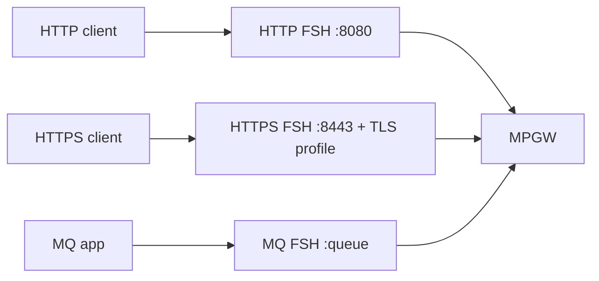
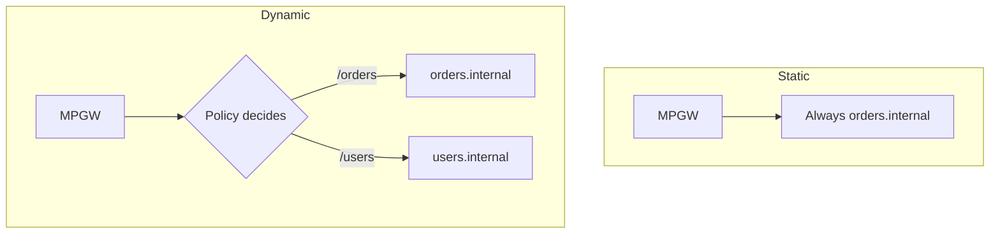

# Front & Back Side Handlers

An MPGW has two sides. The **front side** is how clients reach it; the **back
side** is how it reaches the backend. Keeping them straight is essential.

## Front Side Handlers (FSH)

A **Front Side Handler** is the listener. It defines the **protocol**, the
**local address/interface**, and the **port** the gateway accepts requests on,
plus protocol-specific options.

Key points:

- One MPGW can have **multiple** front-side handlers — e.g. HTTP **and** HTTPS
  **and** MQ all feeding the same policy.
- Common handler types: **HTTP**, **HTTPS (SSL/TLS)**, **IBM MQ**, **TIBCO EMS**,
  **WebSphere JMS**, **FTP/SFTP**, **NFS**, **stateless raw TCP**.
- An **HTTPS handler** references a **TLS server profile** (Module 4) to
  terminate TLS.
- Handlers are reusable objects — but each listens on a specific address/port, so
  two enabled handlers can't bind the same port.

:::tip enabled ≠ up
If a handler is enabled but its port is already taken, it will be **operationally
down**. Recall the admin-state vs. op-state distinction from the
[object model](/docs/architecture/object-model).
:::

## The back side

The back side is how the MPGW reaches the backend after processing.

- **Static backend** — a fixed destination URL configured on the MPGW (e.g.
  `https://orders.internal:443`). Every request goes there.
- **Dynamic backend** — no fixed URL; the **processing policy** sets the
  destination at runtime (typically with a *route* action or by setting the
  service variable for the backend URL). Use this for content-based routing.

## Back-side connection options

The back side also carries connection settings that matter in production:

- **TLS client profile** — to re-encrypt to the backend (mutual TLS).
- **Timeouts** and **persistent connections** — how long to wait, whether to
  reuse connections.
- **Load distribution** — via a *load balancer group* object listing multiple
  backend members with a health-check and algorithm.

## Putting it together

A typical secure MPGW: an **HTTPS front-side handler** (with a TLS server
profile) feeding a policy, with a **static or dynamic backend** reached over a
**TLS client profile**. You'll build exactly this in
[Lab: Build an MPGW](/docs/labs/lab-build-mpgw).

<Quiz questions={[
  {
    prompt: 'What does a Front Side Handler define?',
    options: [
      {text: 'The backend database schema'},
      {text: 'The protocol, address, and port the MPGW listens on for client requests', correct: true},
      {text: 'The XSLT used to transform messages'},
      {text: 'The firmware version'},
    ],
    explanation: 'A front-side handler is the listener: it sets how clients reach the service (protocol + address + port + protocol options).',
  },
  {
    prompt: 'You need to route requests to different backends based on the request URL. Which back-side approach do you use?',
    options: [
      {text: 'A static backend'},
      {text: 'A dynamic backend, with the policy setting the destination at runtime', correct: true},
      {text: 'A second front-side handler'},
      {text: 'It’s not possible on an MPGW'},
    ],
    explanation: 'Content-based routing requires a dynamic backend, where a route action in the processing policy chooses the destination per request.',
  },
]} />

<LessonComplete lessonId="multi-protocol-gateway/handlers" />
