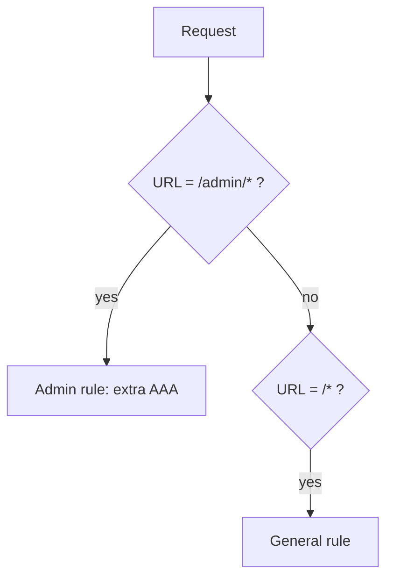
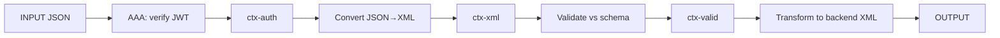

# Matches & Actions

This lesson zooms in on the two building blocks introduced previously: the
**Match action** that selects a rule, and the **actions** that do the work.

## The Match action

Every rule begins with a **Match action** that holds one or more **matching
rules**. If a match succeeds, the rule runs. Match types include:

| Match type | Matches on… | Example |
| --- | --- | --- |
| **URL** | The request URI (wildcards allowed) | `/orders/*` |
| **HTTP method** | GET/POST/PUT/… | `POST` |
| **HTTP header** | A header name/value | `Content-Type = application/json` |
| **Error code** | A specific error (for error rules) | `0x01130006` |
| **XPath** | A node in the XML message | `//order[@priority='high']` |
| **Fully matched** | Always true (a catch-all default) | — |

:::tip Order specific before general
Because the first matching rule wins, place specific matches (e.g. `/orders/*`)
**above** a catch-all (`*`). Otherwise the catch-all swallows everything.
:::

## The action catalogue

Actions are dragged onto the rule line in the policy editor and wired
input→output. The ones you'll use most:

- **AAA** — run an AAA policy to authenticate, authorise, and audit. (Module 4.)
- **Validate** — validate the message against an XML Schema or WSDL; reject if
  invalid.
- **Transform** — apply an **XSLT** stylesheet or **GatewayScript** to reshape
  the message (e.g. XML→JSON). (Module 5.)
- **Filter** — run custom logic to accept or reject a message.
- **Convert Query Params / to XML** — turn non-XML input (form posts, JSON) into
  a node-set the engine can work with.
- **Route (Set Variable / Route action)** — choose a dynamic backend
  destination.
- **Crypto (Sign / Verify / Encrypt / Decrypt)** — message-level security
  operations. (Module 4.)
- **Log / Results** — emit logs or send the message on.
- **GatewayScript** — general-purpose JavaScript for arbitrary logic.

## Wiring actions: a worked example

A request rule for a JSON API that must be authenticated, validated, and
transformed to the backend's XML format:

Each action consumes the previous action's output context. If you accidentally
point two actions at `INPUT`, the second silently ignores the first's work — the
classic wiring bug.

## Variables and context

Actions can read and write **service variables** (e.g.
`var://service/routing-url` to set a dynamic backend, or
`var://context/<name>/...` for your own values). GatewayScript and XSLT can get
and set these, which is how actions pass metadata (not just message bodies) down
the pipeline.

## What's next

You now have the full MPGW picture: handlers in, policy with matched rules and
chained actions, backend out. Module 4 secures it (TLS + AAA + threat
protection), and Module 5 goes deep on the Transform and error-handling actions.

<Quiz questions={[
  {
    prompt: 'You have a specific rule for `/admin/*` and a catch-all rule for `*`. To make the admin rule take effect, where must it go?',
    options: [
      {text: 'Below the catch-all rule'},
      {text: 'Above the catch-all rule (specific before general)', correct: true},
      {text: 'In a different domain'},
      {text: 'Order does not matter'},
    ],
    explanation: 'The first matching rule wins, so the specific `/admin/*` rule must appear above the `*` catch-all or it will never be reached.',
  },
  {
    prompt: 'What is the most common beginner bug when chaining actions in a rule?',
    options: [
      {text: 'Using too few colours in the editor'},
      {text: 'Pointing multiple actions at INPUT instead of wiring each to the previous action’s output context', correct: true},
      {text: 'Naming the service'},
      {text: 'Saving the configuration'},
    ],
    explanation: 'Actions must be chained input→output. If a later action reads INPUT instead of the prior action’s output, earlier work is silently discarded.',
  },
]} />

<LessonComplete lessonId="multi-protocol-gateway/match-actions" />
