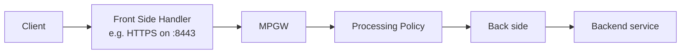
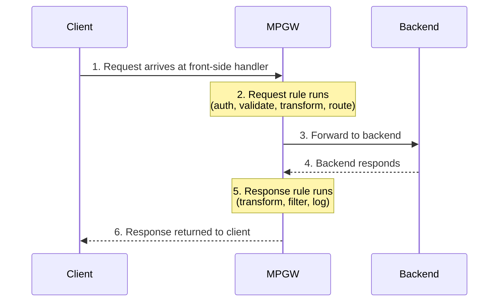

# Multi-Protocol Gateway: Overview

The **Multi-Protocol Gateway (MPGW)** is the service you'll build most often. It
accepts requests on one or more protocols, runs them through a **processing
policy**, and forwards them to a backend — optionally over a *different*
protocol. "Multi-protocol" is the whole point: front and back can differ.

## Anatomy

An MPGW is configured from a few key pieces:

- **One or more front-side handlers** — *how clients reach it* (protocol +
  address + port). One MPGW can listen on several at once (e.g. HTTP and MQ).
- **A processing policy** — *what it does* with each message (the rules and
  actions). Covered in the next two lessons.
- **A backend type** — *where it sends the result*:
  - **Static backend** — always the same fixed backend URL.
  - **Dynamic backend** — the destination is decided at runtime by the policy
    (e.g. route based on the URL or a header).
- **Request/response type** — how to treat the message body: `XML`, `JSON`,
  `SOAP`, `Non-XML` (pass-through/binary), or `Pass-Thru`.

## The request/response lifecycle

Every message flows through the same lifecycle. An MPGW policy has a **request
rule** (client → backend) and usually a **response rule** (backend → client),
plus optional **error rules**.

If anything throws an error, processing jumps to the **error rule** (Module 5).

## A mental model

Hold these three questions in your head whenever you design an MPGW:

1. **How do clients reach it?** → front-side handler(s)
2. **What happens to the message?** → processing policy (request/response rules)
3. **Where does it go?** → static or dynamic backend

The next lessons take each in turn, starting with handlers.

<Quiz questions={[
  {
    prompt: 'What does "multi-protocol" actually mean for an MPGW?',
    options: [
      {text: 'It can only use HTTP'},
      {text: 'The front-side and back-side protocols can differ (e.g. HTTP in, MQ out)', correct: true},
      {text: 'It requires at least three protocols'},
      {text: 'It runs on multiple gateways at once'},
    ],
    explanation: 'An MPGW can accept on one protocol and forward on another, bridging protocols within a single service.',
  },
  {
    prompt: 'Which backend type lets the processing policy decide the destination at runtime?',
    options: [
      {text: 'Static backend'},
      {text: 'Dynamic backend', correct: true},
      {text: 'Front-side handler'},
      {text: 'Pass-Thru type'},
    ],
    explanation: 'A dynamic backend means the policy sets the destination per request (e.g. route by URL or header). A static backend is always the same URL.',
  },
]} />

<LessonComplete lessonId="multi-protocol-gateway/overview" />
