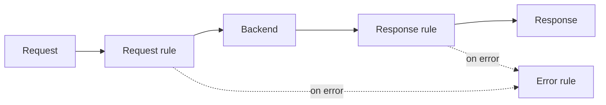
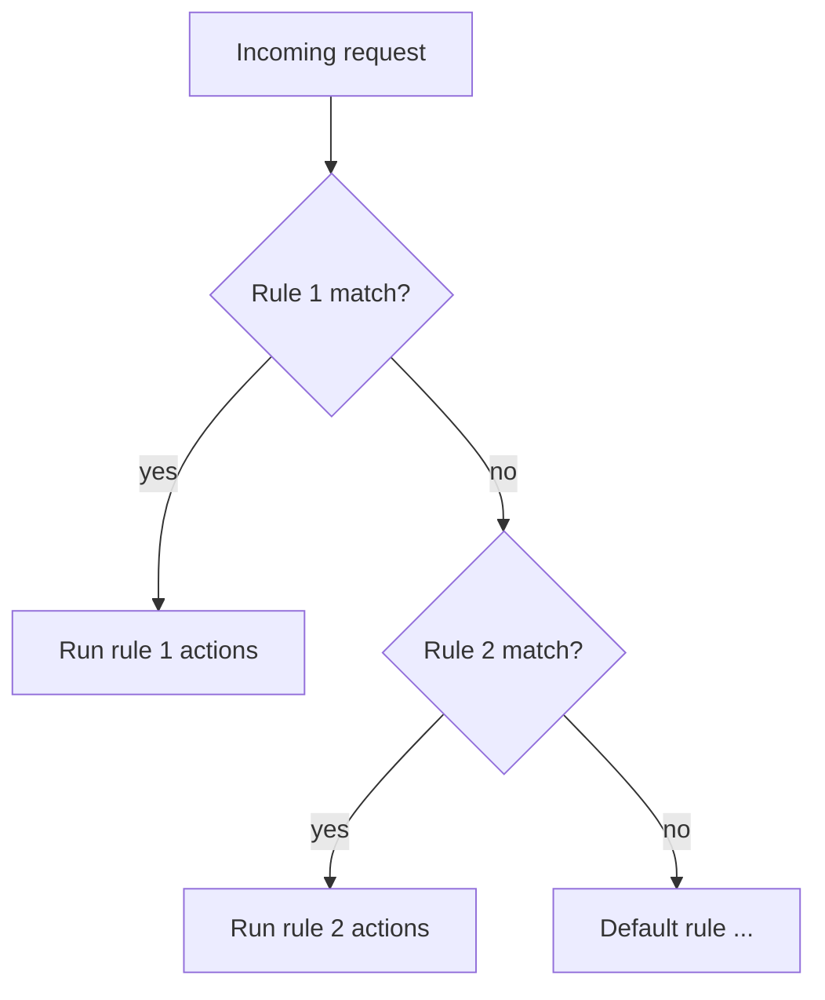
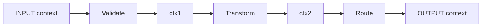

# Processing Policy

The **processing policy** is the brain of an MPGW. It's an ordered set of
**rules**, each made of **actions**, that decide what happens to every message.
If handlers are "how clients reach it" and the backend is "where it goes", the
policy is "what happens in between".

## Rules and direction

A policy contains rules, and each rule has a **direction**:

- **Request (client → server)** — runs on the way *in*, before the backend.
- **Response (server → client)** — runs on the way *out*, after the backend.
- **Both** — runs in either direction.
- **Error** — runs when something fails (covered in Module 5).

## How a rule is matched

Each rule starts with a **Match action** (next lesson). The policy evaluates
rules **top to bottom** for the current direction and runs the **first rule
whose match succeeds**. Order matters — put more specific matches above general
ones.

## Actions and the context pipeline

Within a rule, **actions** run in sequence. Each action reads an **input
context** and writes an **output context** — a named "variable" holding the
message at that stage. Actions are chained by wiring one action's output context
to the next action's input.

Two contexts are special:

- **`INPUT`** — the message as it entered this rule.
- **`OUTPUT`** — the message that will be sent on (to the backend on the request
  side, or to the client on the response side).

Everything in between is contexts *you* name. Getting the wiring right — each
action consuming the previous one's output — is the most common source of
beginner bugs.

## Common action types (preview)

| Action | Purpose |
| --- | --- |
| **Match** | Decide whether the rule applies |
| **AAA** | Authenticate / authorise the request (Module 4) |
| **Validate** | Check the message against a schema/WSDL |
| **Transform** | Run XSLT or GatewayScript (Module 5) |
| **Filter** | Accept/reject based on custom logic |
| **Route** | Set a dynamic backend destination |
| **Results / Route** | Send the message somewhere |
| **Log** | Emit a log message |

We examine matches and actions in detail next.

<Quiz questions={[
  {
    prompt: 'How does the policy decide which rule to run for a given direction?',
    options: [
      {text: 'It runs every rule in parallel'},
      {text: 'It evaluates rules top to bottom and runs the first whose Match action succeeds', correct: true},
      {text: 'It runs the rule with the longest name'},
      {text: 'It picks a rule at random'},
    ],
    explanation: 'Rules are matched in order; the first matching rule (for that direction) executes. So ordering specific-before-general matters.',
  },
  {
    prompt: 'What are the INPUT and OUTPUT contexts?',
    options: [
      {text: 'The names of two backends'},
      {text: 'INPUT is the message entering the rule; OUTPUT is the message that gets sent on', correct: true},
      {text: 'Front and back side handlers'},
      {text: 'Two firmware partitions'},
    ],
    explanation: 'Actions read an input context and write an output context. INPUT is the incoming message; OUTPUT is what’s forwarded (to backend or client).',
  },
]} />

<LessonComplete lessonId="multi-protocol-gateway/processing-policy" />
