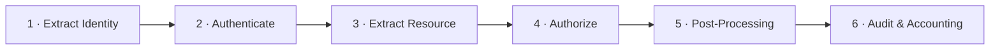

# The AAA Framework

:::info Lesson status
This lesson is a focused **outline**. The core model below is complete; expand
each phase with the linked IBM docs and the hands-on
[AAA lab](/docs/labs/lab-aaa).
:::

**AAA** stands for **Authentication, Authorisation, and Audit**. An **AAA policy**
is an object you attach via an **AAA action** in a processing rule. It answers:
*who is calling, what are they allowed to do, and how do we record it?*

## The six AAA phases

A DataPower AAA policy runs the same ordered pipeline every time:

1. **Extract Identity (EI)** — where is the caller's identity? (HTTP Basic auth,
   a JWT/bearer token, a client TLS cert, a WS-Security token, an API key…)
2. **Authenticate (AU)** — verify that identity against a source (LDAP, an OIDC/
   OAuth provider, validate a JWT signature, a local user list, an external
   service).
3. **Extract Resource (ER)** — what is being accessed? (the URL, the SOAP
   operation, an HTTP method…)
4. **Authorize (AZ)** — is *this identity* allowed to access *this resource*?
   (LDAP group membership, an XACML/policy decision, an allow list…)
5. **Post-Processing (PP)** — act on the result: generate a token for the
   backend (e.g. an LTPA token, a fresh JWT), map credentials, add headers.
6. **Audit & Accounting** — log the decision for traceability and compliance.

## Why it's a framework

Each phase is **pluggable**: you pick a method per phase independently. That's
how one model covers everything from "HTTP Basic against LDAP" to "validate an
OAuth JWT and mint an LTPA token for WebSphere".

## Outline: topics to expand

- Validating **JWT** and **OAuth 2.0 / OIDC** tokens in the AU phase.
- **LDAP** bind/search for authentication and group-based authorisation.
- Mapping credentials and **generating backend tokens** (LTPA, SAML, JWT) in PP.
- Reusing one AAA policy across many services (it's just an object reference).

## Reference

- [Lab: Configure AAA](/docs/labs/lab-aaa)
- IBM Docs: *AAA policy* and *Configuring a AAA policy* in the
  [DataPower documentation](https://www.ibm.com/docs/en/datapower-gateway).

<Quiz questions={[
  {
    prompt: 'What do the three "A"s in AAA stand for?',
    options: [
      {text: 'Acquire, Allocate, Archive'},
      {text: 'Authentication, Authorisation, Audit', correct: true},
      {text: 'Async, Atomic, Available'},
      {text: 'Accept, Append, Apply'},
    ],
    explanation: 'AAA = Authentication (who are you), Authorisation (what may you do), and Audit (record it).',
  },
  {
    prompt: 'In which AAA phase would you mint a backend token (e.g. LTPA or a fresh JWT) for the downstream system?',
    options: [
      {text: 'Extract Identity'},
      {text: 'Post-Processing', correct: true},
      {text: 'Extract Resource'},
      {text: 'Authenticate'},
    ],
    explanation: 'Post-Processing acts on a successful decision — including credential mapping and generating tokens the backend expects.',
  },
]} />

<LessonComplete lessonId="security/aaa" />
