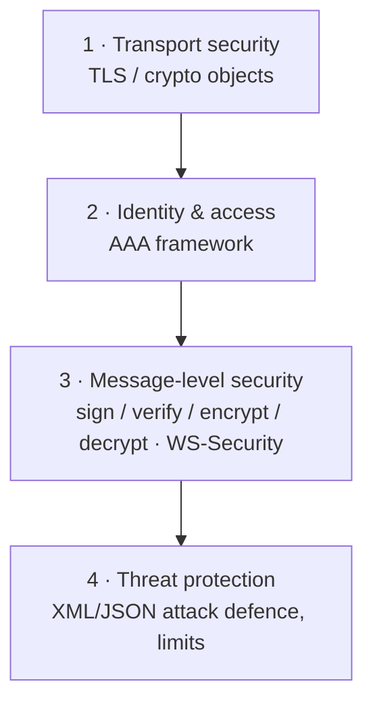

# Security Overview

Security is DataPower's heritage. Rather than one feature, it provides several
**layers** that you combine to match your threat model. This lesson maps the
landscape; the following lessons drill into each layer.

## The four layers

1. **Transport security (TLS).** Encrypt and optionally mutually authenticate
   the connection. Configured with **crypto objects** and **TLS profiles**.
   → [TLS & Crypto Objects](/docs/security/tls-crypto)
2. **Authentication, Authorisation, Audit (AAA).** *Who* is calling, *are they
   allowed*, and *record it*. Configured with an **AAA policy**.
   → [The AAA Framework](/docs/security/aaa)
3. **Message-level security.** Protect the *message itself* (not just the pipe):
   digital signatures, field/element encryption, WS-Security for SOAP.
4. **Threat protection.** Defend against malicious or malformed input: XML
   bombs, oversized payloads, injection patterns, schema violations.
   → [Threat Protection](/docs/security/threat-protection)

## Transport vs. message-level security

A frequent point of confusion:

- **Transport (TLS)** secures the **connection** between two hops. Once the
  message is decrypted at the gateway, it's in the clear inside the box.
- **Message-level** security travels **with the message** end-to-end, surviving
  multiple hops and intermediaries — essential when a message passes through
  systems you don't fully trust.

You often use both: TLS for the hop, plus a signature so the backend can verify
the message wasn't tampered with in between.

## Defence in depth at the edge

Because DataPower sits in the DMZ, it's the natural place to enforce all four
layers *before* a request touches the internal network — terminate TLS,
authenticate the caller, check the message, and scan for threats, rejecting bad
traffic early.

:::note This module
The next lesson covers TLS and crypto objects in full. AAA and threat protection
are introduced as focused outlines you can expand with the linked IBM docs and
the [AAA lab](/docs/labs/lab-aaa).
:::

<Quiz questions={[
  {
    prompt: 'What is the key difference between transport security and message-level security?',
    options: [
      {text: 'They are the same thing'},
      {text: 'Transport (TLS) secures the connection between two hops; message-level security travels with the message end-to-end', correct: true},
      {text: 'Message-level security only works on the physical appliance'},
      {text: 'Transport security encrypts individual XML elements'},
    ],
    explanation: 'TLS protects the pipe for one hop; once decrypted at the gateway the message is in the clear. Message-level signing/encryption stays attached to the message across hops.',
  },
]} />

<LessonComplete lessonId="security/overview" />
