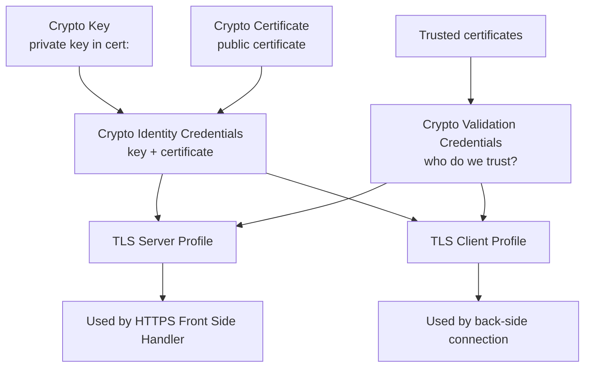
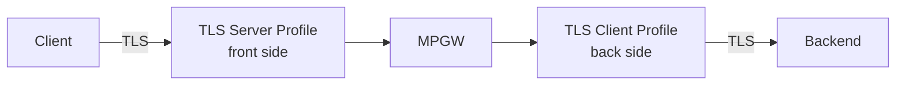

# TLS & Crypto Objects

To terminate or originate TLS, DataPower assembles a small stack of **crypto
objects**. They look fiddly at first, but it's a clean hierarchy once you see
how the pieces reference each other (remember: everything is an object that
points at other objects).

## The crypto object hierarchy

From the bottom up:

- **Crypto Key** — a private key, uploaded into the write-only `cert:` store.
  (Keys can be written but not read back, by design.)
- **Crypto Certificate** — the matching public certificate.
- **Crypto Identity Credentials** — pairs a key + certificate to present *our*
  identity (the server cert we show clients, or the client cert we present to a
  backend).
- **Crypto Validation Credentials** — the set of certificates we **trust** when
  validating the *other* party's certificate (a trust store).

## TLS profiles

Two profile types assemble those credentials for a direction:

- **TLS Server Profile** — used on the **front side** to *terminate* TLS. It
  presents our identity credentials to clients. Enable **mutual TLS** by also
  giving it validation credentials so clients must present a trusted cert.
- **TLS Client Profile** — used on the **back side** to *originate* TLS to a
  backend. It validates the backend's cert (validation credentials) and can
  present a client cert (identity credentials) for mutual TLS.

## A typical secure path

1. Upload the server **key** and **certificate** into `cert:`.
2. Build **identity credentials** from them.
3. Build **validation credentials** from your trusted CA certs.
4. Create a **TLS server profile** referencing the identity creds (and
   validation creds if you want mutual TLS).
5. Reference that profile from an **HTTPS front-side handler**.
6. For the back side, create a **TLS client profile** and reference it from the
   MPGW's backend connection.

You'll do exactly this in [Lab: Add a TLS Profile](/docs/labs/lab-tls-profile).

## Good practices

- Prefer **TLS 1.2/1.3**; disable old protocols and weak ciphers in the profile.
- Use **separate** profiles per trust boundary rather than one giant shared one.
- Keep an eye on **certificate expiry** — an expired cert silently takes a
  service operationally **down**.

<Quiz questions={[
  {
    prompt: 'Which object holds the set of certificates DataPower trusts when validating the *other* party’s certificate?',
    options: [
      {text: 'Crypto Identity Credentials'},
      {text: 'Crypto Validation Credentials', correct: true},
      {text: 'Crypto Key'},
      {text: 'Front Side Handler'},
    ],
    explanation: 'Validation credentials are the trust store. Identity credentials present *our* key+certificate; validation credentials decide whose certs we trust.',
  },
  {
    prompt: 'On the front side of an MPGW, which profile terminates incoming TLS?',
    options: [
      {text: 'TLS Client Profile'},
      {text: 'TLS Server Profile', correct: true},
      {text: 'AAA Policy'},
      {text: 'Load balancer group'},
    ],
    explanation: 'A TLS server profile terminates client TLS on the front side; a TLS client profile originates TLS to the backend on the back side.',
  },
]} />

<LessonComplete lessonId="security/tls-crypto" />
